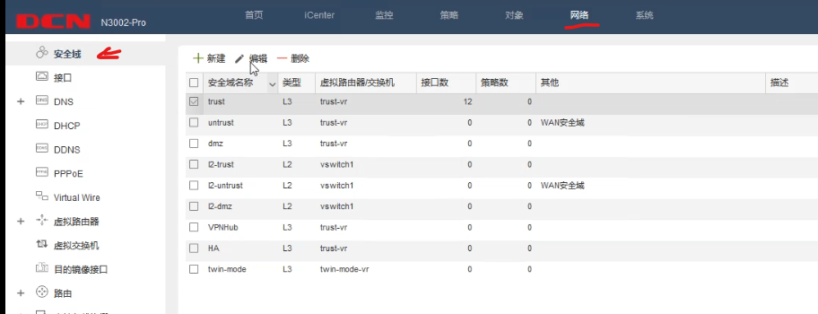
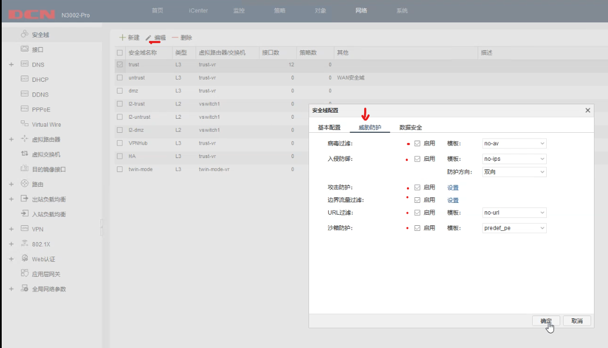
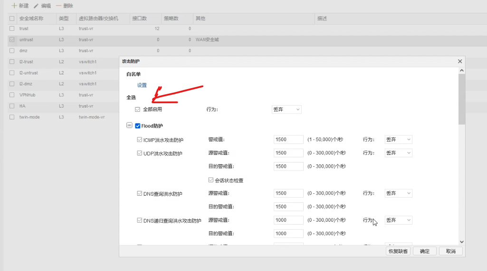
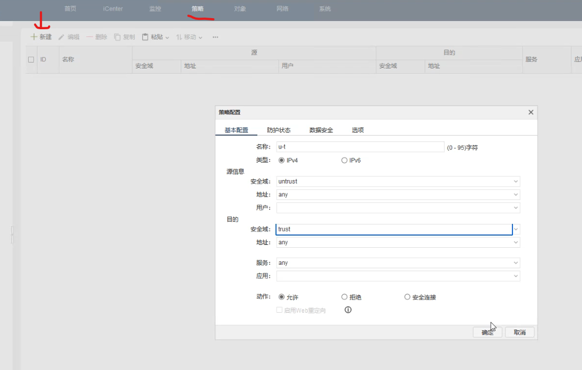
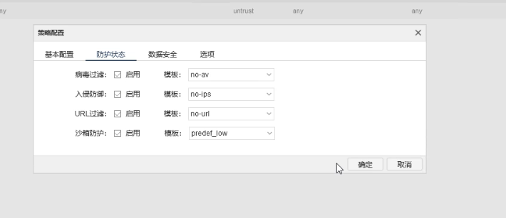
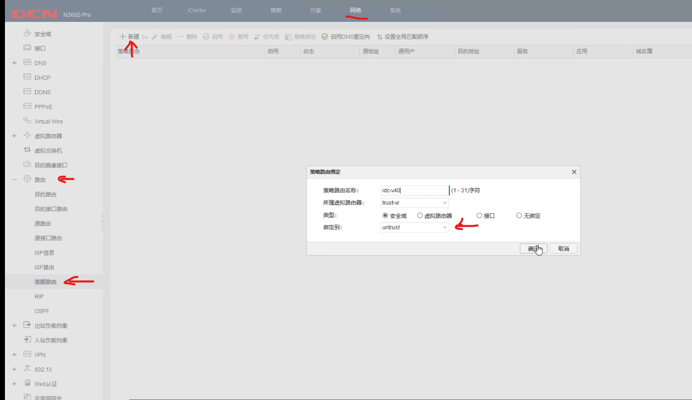
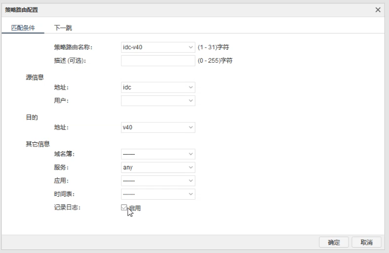
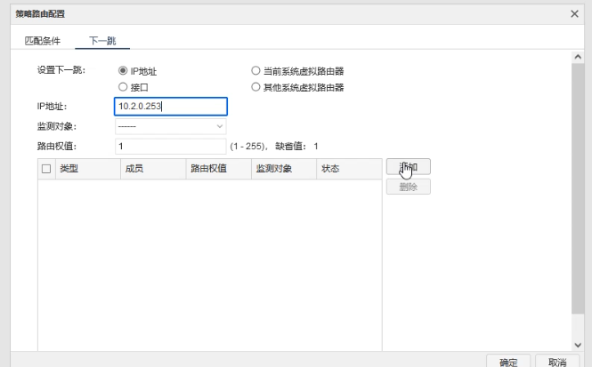

# RS相关题目操作

##### 1、RS开启telnet登录功能，用户名skills01，密码skills01，配置使用telnet方式登录终端界面前显示如下授权信息：“WARNING!!! Authorised access only, all of your done will be recorded! Disconnected IMMEDIATELY if you are not an authorised user! Otherwise, we retain the right to pursue the legal responsibility”；

```
# 设置标语
banner login WARNING!!! Authorised access only, all of your done will be recorded! Disconnected IMMEDIATELY if you are not an authorised user! Otherwise, we retain the right to pursue the legal responsibility

# 开启telnet服务
telnet-server enable

# 创建一个用户	（15是授予最高权限 0是密码不加密）
username skills01 privilege 15 password 0 skills01 

# 使用户使用本地的权限登陆
authentication line vty login local
```

验证：在特权模式下使用telnet登陆自己

```
telnet 127.0.0.1
```


##### 2、总部交换机SW配置简单网络管理协议，计划启用V3版本，V3版本在安全性方面做了极大的扩充。配置引擎号分别为62001；创建认证用户为skills01，采用3des算法进行加密，密钥为：skills01，哈希算法为SHA，密钥为：skills01；加入组ABC，采用最高安全级别；配置组的读、写视图分别为：2022_R、2022_W；当设备有异常时，需要使用本地的VLAN100地址发送Trap消息至网管服务器10.51.0.203，采用最高安全级别

```
# 开启snmp服务
snmp-server enable
# 配置引擎号
snmp-server engineid 62001

# 创建认证用户为skills01，采用3des算法进行加密，密钥为：skills01，哈希算法为SHA，密钥为：skills01；加入组ABC，采用最高安全级别
snmp-server user skills01 ABC authPriv 3des skills01 auth sha skills01

# 加入组ABC，采用最高安全级别；配置组的读、写视图分别为：2022_R、2022_W
snmp-server group ABC authPriv read 2022_R write 2022_W

snmp-server view 2022_R 1 include
snmp-server view 2022_W 1 include

# 启用traps服务
snmp-server enable traps
rmon enable
# 发送traps使用的vlan100地址
snmp-server trap-source 192.169.100.1
# 发送traps消息的目的地址和最高安全等级
snmp-server host 10.51.0.203 v3 Authpriv skills01

```

验证：

```
# 查看相关配置
show snmp status
# 查看更多
show snmp ?
```


##### 3、对RS上VLAN40开启以下安全机制：业务内部终端相互二层隔离，启用环路检测，环路检测的时间间隔为10s，发现环路以后关闭该端口，恢复时间为30分钟；如发现私设DHCP服务器则关闭该端口，配置防止ARP欺骗攻击

```
# 二层隔离：在相同网段下的主机都不能通信
# 启动二层隔离
isolate-port group vlan40		# 新建隔离组
isolate-port apply l2		# 二层隔离
isolate-port group vlan40 switchport interface ethernet 1/0/4-8		#应用到4-8口

# 环路检测
loopback-detection control-recovery timeout 1800	# 检测环路并且1800秒后恢复
loopback-detection interval-time 10 10		# 每隔10秒检测一侧
interface ethernet 1/0/4-8
loopback-detection specified-vlan 40 
loopback-detection control shutdown		# 检测到环路的动作

# DHCP和arp的防护
ip dhcp snooping enable
ip dhcp snooping binding enable
ip dhcp snooping binding arp
# 私设DHCP服务关闭
interface ethernet 1/0/4-8
ip dhcp snooping action shutdown
# 保护网关不被arp欺骗
arp-guard ip 172.16.40.62
# 终端必须通过DHCP联网
ip dhcp snooping binding user-control

```


##### 4、勒索蠕虫病毒席卷全球，爆发了堪称史上最大规模的网络攻击，通过对总部核心交换机RS所有业务VLAN下配置访问控制策略实现双向安全防护

```
ip access-list extended acl_smb
# 拒绝所有源目地址的445TCP和UDP访问
deny udp any-source any-destination d-port 445
deny udp any-source any-destination d-port range 135 139
deny tcp any-source any-destination d-port 445
deny tcp any-source any-destination d-port range 135 139
# 设置acl规则属于vlan业务范围
vacl ip access-group acl_smb in traffic-statistic vlan 40;50-52;113-118;100;4000
vacl ip access-group acl_smb out traffic-statistic vlan 40;50-52;113-118;100;4000


```


##### 5、RS配置IPv6地址，使用相关特性实现VLAN50的IPv6终端可自动从网关处获得IPv6有状态地址。WS配置IPv6地址，开启路由公告功能，路由器公告的生存期为2小时，确保VLAN30的IPv6终端可以获得IPv6无状态地址

###### 5.1、RS配置IPv6地址，使用相关特性实现VLAN50的IPv6终端可自动从网关处获得IPv6有状态地址

​	RS配置命令如下：

```
# 开启DHCP及rip服务
service dhcpv6
router IPv6 rip

# 创建地址池
ipv6 dhcp pool ipv6vlan50
network-address 2001:50::1 2001:50::253

# 在vlan50配置DHCP服务
interface vlan50
ipv6 address 2001:50::254/64
ipv6 dhcp server ipv6vlan50
ipv6 nd managed-config-flag		# 分配有状态地址
ipv6 nd other-config-flag		# 分配有状态地址
ipv6 router rip

# 在vlan100开启rip服务
interface vlan100
ipv6 router rip


```

###### 5.2、WS配置IPv6地址，开启路由公告功能，路由器公告的生存期为2小时，确保VLAN30的IPv6终端可以获得IPv6无状态地址

​	WS配置命令如下：

```
service dhcpv6
router IPv6 rip

interface vlan30
ipv6 address 2001:30::254/64
no ipv6 nd suppress-ra		# 关闭ra抑制 补充：关闭ra抑制后，连接终端可以自动从WS根据前缀生成IPv6地址
ipv6 nd ra-lifetime 7200
ipv6 nd other-config-flag	# 开启无状态地址
ipv6 router rip

interface vlan100
ipv6 router rip
 
```

 

##### 6、尽可能加大RS与防火墙FW之间的带宽；配置使总部VLAN40业务的用户访问IDC SERVER的数据流经过FW 10.1.0.254, IDC SERVER返回数据流经过FW 10.2.0.254，且对双向数据流开启所有安全防护，参数和行为为默认

​	RS配置如下：

```
# 新建策略及范围
ip access-list extended v40-idc
permit ip 172.16.40.0 0.0.0.63 10.100.18.0 0.0.0.31

class-map v40-idc
match access-group v40-idc

policy-map v40-idc
class v40-idc
set ip nexthop  10.1.0.254		# 如果匹配设置下一跳

# 在4-8口入方向应用策略
int e1/0/4-8
service-policy input v40-idc

```

​	防火墙配置如下：

1、确保RS与FW所连接接口设置端口汇聚，启用lacp模式

2、安全域开启所有安全防护（**其他安全域均需要设置**）







3、配置防护策略：（trust-untrust; untrust-trust）





4、配置策略路由：






 


##### 7、FW、RS、WS之间配置OSPF area 0 开启基于链路的MD5认证，密钥自定义,传播访问INTERNET默认路由

​	RS配置：

```
router ospf 1
area 0 authentication message-digest
network 0.0.0.0 255.255.255.255 area 0		# 通告所有网段
exit
interface vlan 113
ip ospf authentication message-digest
ip ospf message-digest-key 1 MD5 0 yourpassword
interface vlan 114
ip ospf authentication message-digest
ip ospf message-digest-key 1 MD5 0 yourpassword
interface vlan 115
ip ospf authentication message-digest
ip ospf message-digest-key 1 MD5 0 yourpassword
interface vlan 116
ip ospf authentication message-digest
ip ospf message-digest-key 1 MD5 0 yourpassword
interface vlan 100		# 关闭vlan100的ospf
ip ospf disable all

```

​	WS配置：

```
router ospf 1
area 0 authentication message-digest
network 0.0.0.0 255.255.255.255 area 0		# 通告所有网段
exit
interface vlan 115
ip ospf authentication message-digest
ip ospf message-digest-key 1 MD5 0 yourpassword
interface vlan 116
ip ospf authentication message-digest
ip ospf message-digest-key 1 MD5 0 yourpassword
interface vlan 100		# 关闭vlan100的ospf
ip ospf disable all

```

​	FW配置：

```
ip vrouter trust-vr		# 进入虚拟路由模式
ip route 0.0.0.0/0 200.1.1.2	# 设置默认路由指向Internet
router ospf 1
router-id 1.1.1.1
area 0 authentication message-digest	# 开启MD5认证
default-information originate always	# 传播默认路由
network 10.1.0.252/30 area 0
network 10.2.0.252/30 area 0
Exit
exit
int aggregate1.113
ip ospf authentication message-digest
ip ospf message-digest-key 1 MD5 yourpassword
int aggregate1.114
ip ospf authentication message-digest
ip ospf message-digest-key 1 MD5 yourpassword

```


##### 9、如果RS E1/0/3端口的收包速率超过30000则关闭此端口，恢复时间5分钟，并每隔10分钟对端口的速率进行统计；为了更好地提高数据转发的性能，RS交换中的数据包大小指定为1600字节

```
mtu 1600
port-rate-statistics interval 600	# 每隔10分钟对端口的速率进行统计
interface ethernet 1/0/3
rate-violation all 30000
rate-violation control shutdown recovery 300	 # 如果RS E1/0/3端口的收包速率超过30000则关闭此端口，恢复时间5分钟

```

