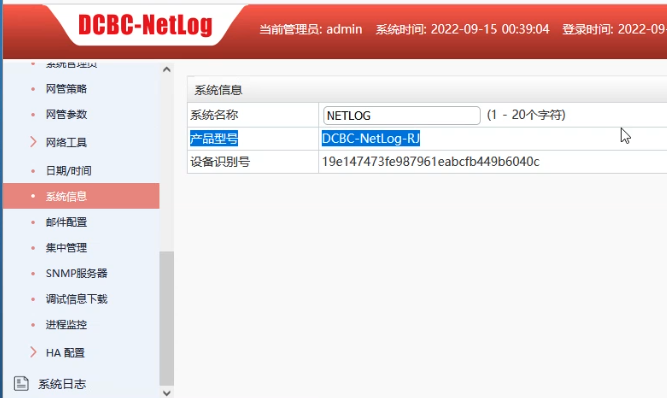
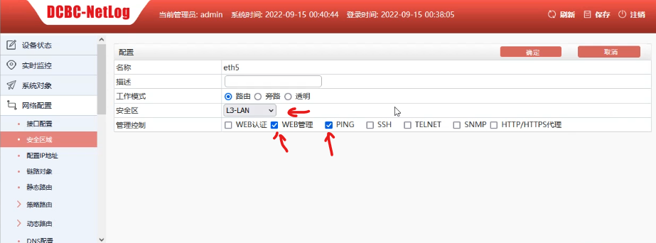

# 任务一：网络平台的搭建

### 1、按照IP地址规划表，对防火墙的名称、各接口IP地址进行配置。

**前提条件**：PC需要连接防火墙的**E0/0口**。将PC的 **IP** 地址设置为和防火墙的同一个网段。登陆防火墙网络配置平台可能要用 **https** 方式登陆。


根据题目给出的配置表格，对防火墙进行相应的配置：


#### 第一步：更改主机名：


直接点击主机名后的编辑即可。

#### 第二步：配置相应接口和IP地址

ETH0/1-2口需要配置端口汇聚，且都在Trust安全域里


 选择集聚接口


接口名称选择1、绑定安全域选择三层安全域、安全域选择Trust


PS：为了调试方便，可以将管理方式的ping打开


添加完成后选择该接口，点击编辑


将接口选择的1和2口添加到端口选择选项中


新建集聚子接口，为其添加IP地址


接口名称填写113，属于trust安全域填入题目要求的IP地址及子网掩码。将管理方式的ping打开

**注意：接口名称的由来是根据该接口对端所连接三层交换机的VLAN号得来的，不可以随便填**


同样的方式按照题目的要求再添加一个

**到此集聚接口配置完毕**


选中eth0/3接口点击编辑可以直接配置该接口的IP地址及相应安全域。相应的可继续配置4、5、6接口


添加回环接口


添加相应配置

**同理可配置剩下3个回环接口**


### 2、按照IP地址规划表，对三层交换机的名称进行配置，创建VLAN并将相应接口划入VLAN, 对各接口IP地址进行配置。

根据题目的要求vlan一共有40；50-52；113-118；100；400这么多个

 **tips:再开始配置前应先输入 enable 进入特权模式；然后输入 conf 进入配置模式**

创建vlan，并将相应的vlan配置好IP

```
vlan 40;50-52;113-118;100;4000

int vlan 40
ip addr 172.16.40.62 255.255.255.192
 
int vlan 50
ip addr 172.16.50.62 255.255.255.192
 
int vlan 51
ip addr 10.51.0.254 255.255.255.252
 
int vlan 52
ip addr 10.52.0.254 255.255.255.252
 
int vlan 113
ip addr 10.1.0.253 255.255.255.252
 
int vlan 114
ip addr 10.2.0.253 255.255.255.252
 
int vlan 115
ip addr 10.5.0.254 255.255.255.252
 
int vlan 116
ip addr 10.6.0.254 255.255.255.252
 
int vlan 117
ip addr 10.3.0.253 255.255.255.252
 
int vlan 118
ip addr 10.4.0.253 255.255.255.252
 
int vlan 100
ip addr 192.168.100.1 255.255.255.252
ipv6 addr 2001::192:168:100:1/112

int vlan 4000
ip addr 200.1.1.2 255.255.255.224
```

 

将接口划入vlan(**非trunk口**)

```
int e1/0/4-8
sw ac vl 40

int e1/0/3
sw ac vl 50

int e1/0/23
sw ac vl 51

int e1/0/24
sw ac vl 52

int e1/0/17
sw ac vl 117

int e1/0/18
sw ac vl 118

int e1/0/19
sw ac vl 119
```

将接口划入vlan(**trunk口**)

```
int e1/0/20
sw mo tr
sw tr al vl all

```

 端口汇聚

```
# 创建汇聚接口1
port-group 1

int e1/0/1-2
# 对端模式选择了LACP 所以配置active
port-group 1 mode active 
# 将汇聚好的端口调整为trunk模式
int port-channel 1

sw mo tr

sw tr al vl all
```

补充

```
# 进入编辑模式
config
# 修改主机名
hostname RS
# 回到特权模式
quit
# 保存 【  非常重要！！！！！！！！  】
wr


```


测试; ping 10.1.0.254  ping 10.2.0.254


### 3、按照IP地址规划表，对无线交换机的名称进行配置，创建VLAN并将相应接口划入VLAN,对接口IP地址进行配置

根据题目图表的要求，配置命令如下：

```
# 进入配置模式
enable
config

# 给设备命名
hostname WS

# 创建vlan配置ip
vlan 10;20;101;30;100;115;116

int vlan 10
ip addr 10.80.0.254 255.255.255.0

int vlan 20
ip addr 10.80.1.62 255.255.255.192

int vlan 30
ip addr 172.16.30.62 255.255.255.192

int vlan 100
ip addr 192.168.100.2 255.255.255.252
ipv6 addr 2001::192:168:100:2/112

int vlan 101
ip addr 10.80.1.66 255.255.255.252

int vlan 115
ip addr 10.5.0.253 255.255.255.252

int vlan 116
ip addr 10.6.0.253 255.255.255.252

# 相应接口划入vlan 
int e1/0/20
sw mo tr
sw tr al vl all


int e1/0/3
sw ac vl 30

int e1/0/21
sw mo tr
sw tr al vl all
sw tr native vl 101   # vlan101控制AP， 应配置native vlan；就是给数据打pvid标签

# 测试ping通
ping 192.168.100.1
ping 10.5.0.254
ping 10.6.0.254

# 保存
wr
```


### 4、按照IP地址规划表，对网络日志系统的名称、各接口IP地址进行配置

ps: 初始密码如果不是 **admin@PWD** 的话可能是 **admin*PWD**

##### 更改主机名：



##### 配置eth5口的IP地址


##### 补充：

配置安全域，使其可以被ping通





### 5、按照IP地址规划表，对WEB应用防火墙的名称、各接口IP地址进行配置

##### 更改主机名


##### 3口4口配置网桥IP


##### 接口划入网桥


**接口4同理**

##### 补充：

可用RS设备ping 10.52.0.253 验证